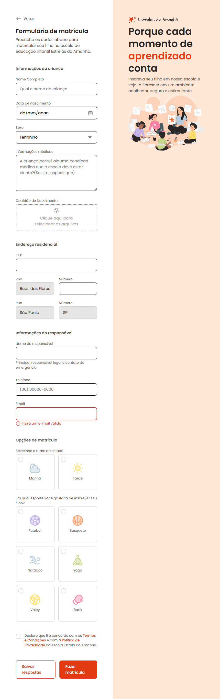

# Formulário de Notícias - Escola Estrelar do Amanhã

Formulário de Notícias - Escola Estrelar do Amanhã é uma página web que demonstra os aprendizados sobre formulários construída com **HTML** e **CSS**, que utiliza técnicas de **GRID** e **FLEX** para a criação de um layout moderno.



## Visão Geral

O formulário disponibiliza diversos tipo de input e customozações dos mesmo.

### Tecnologias Utilizadas

- **HTML5**: Estrutura semântica da página.
- **CSS3**: Estilização e design visual da página.
  - **GRID** e **FLEX**: Usado para alinhar e distribuir os elementos.
  - **Atributos de CSS**: Utilizados para ajustar o espaçamento, estilo de fonte, e outros detalhes visuais.

## Funcionalidades

1. **Informações da criança**:
2. **Upload de Arquivos**:
3. **Endereço**
4. **Informações do responsável**
5. **Escolha de Turnos**
6. **Escolha de Cursos**
7. **Termos e condições**

## Como Executar o Projeto

1. Clone o repositório:
   ```bash
   git clone https://github.com/hallancma/mba-rockeseat-sirius-projetos-03-formulario-de-matricula-escola-estrela-do-amanha
   ```
2. Abra o arquivo `index.html` em seu navegador para visualizar a página.

## Ver Projeto

Para ver o projeto em funcionamento, você pode visitar o link abaixo:

[Ver Projeto](https://formulariomatricula.hallanchristian.com.br/)
